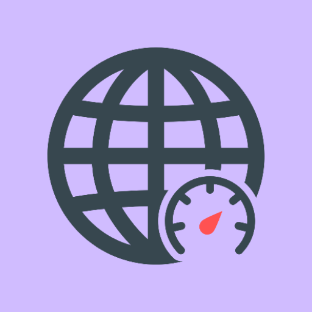

# Pixel Meter

  

  <strong>Precise internet speed monitor designed for Pixel and Native Android.</strong>

    
    
    

[简体中文](README_CN.md)

## About

Pixel Meter is a network speed monitor application designed specifically for Google Pixel and native
Android devices. Unlike traditional speed monitors, Pixel Meter solves a common issue where using a
VPN causes the displayed network speed to be double the actual speed (counting both the physical
interface and the virtual VPN interface).

**Pixel Meter intelligently filters out VPN traffic**, directly reading from physical network
interfaces (Wi-Fi, Cellular, Ethernet) to provide accurate real-time speed statistics.

## Screenshots

  

  

## Features

- **Precise Traffic Stats**: Uses `ConnectivityManager` and `TrafficStats` to filter out `tun0` and
  other virtual interfaces.
- **Native Experience**: Built with Jetpack Compose and Material 3, supporting Dynamic Color on
  Pixel devices.
- **Flexible Display**:
    - **Notification Bar**: Dynamic icon that updates in real-time. Supports customizable display
      modes (Total Speed, Upload Only, Download Only) and text prefixes.
    - **Floating Window**: Overlay that can be toggled and moved independently. Fully customizable:
        - Background and Text Color
        - Corner Radius and Text Size
        - Custom Text Prefixes and Order
    - **Quick Settings Tiles**: Toggle Overlay and Notification directly from the system control
      panel.
- **Live Update**: Supports Android 16+ status bar chip update.
- **Privacy Focused**: All data is processed locally. No traffic data is uploaded.
- **Built-in Tools**: Integrated Cloudflare Speed Test via Chrome Custom Tabs.

## Requirements

- **Device**: Google Pixel series (recommended) or devices running native Android (AOSP).
- **Android Version**: Android 12 (API Level 31) or higher.
- **Permissions**: Notification (for the status bar icon) and Overlay (for the floating window).

## Architecture

- **Language**: Kotlin
- **UI Framework**: Jetpack Compose (Material 3)
- **Architecture Pattern**: MVVM + Clean Architecture
- **Dependency Injection**: Koin
- **Data Source**: `TrafficStats` + `ConnectivityManager` (Single Source of Truth)

## License

This project is licensed under the Apache License 2.0. See the [LICENSE](LICENSE) file for details.
